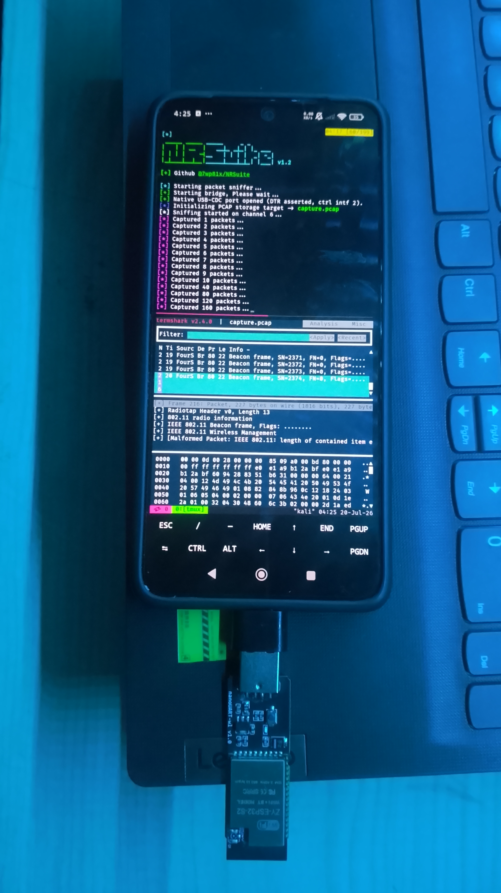
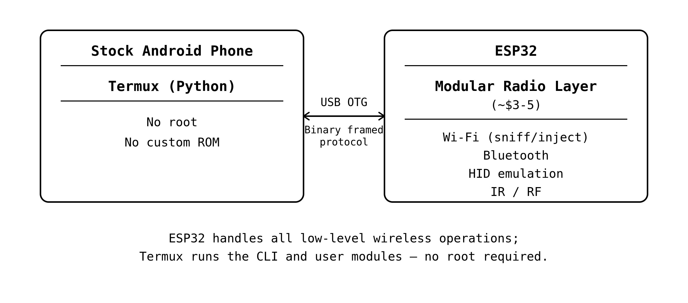

# NRSuite

Turn a $3 ESP32 into a wireless research toolkit for Termux. No root required.


NRSuite bypasses Android's locked-down radio APIs by offloading the radio layer to an ESP32 over USB OTG, turning a stock unrooted Android phone into a wireless research toolkit. The firmware and bridge protocol are modular by design, so new radio backends and capabilities slot in without touching the transport layer.

<p align="center">
  
</p>

<p align="center">
  
</p>

> **Authorized use only.** Only use this on networks and devices you own or have explicit written permission to test. Unauthorized interception of network traffic is illegal in most jurisdictions.

## Why this exists

Android has never exposed monitor mode, raw packet injection, or low-level radio control to user-space apps. The old way meant a rooted phone, a custom kernel like NetHunter, a supported external USB adapter, and a lot of luck matching hardware versions.

NRSuite sidesteps all of that:

- The **ESP32** handles everything radio-level: promiscuous capture, channel hopping, raw frame injection
- **Termux** talks to it over USB CDC using `termux-usb` and libusb. No root, no kernel modules, no custom ROM
- The **Python bridge** uses a compact framed binary protocol with flow control, not serial ASCII
- The **firmware and protocol are modular**, so new radio backends slot in without touching the transport layer

Total hardware cost: under $5. Works on any Android phone with USB-C or micro-USB and an OTG cable.

## Features

- [x] **WiFi scan** - active scan with SSID, BSSID, channel, RSSI, security type
- [x] **Packet sniffing** - fixed channel or channel-hopping promiscuous capture, `.pcap` output, live stream via FIFO
- [x] **EAPOL capture** - passive handshake capture, optional BSSID/client filtering
- [x] **Deauthentication** - standalone deauth, or combined with sniffing to trigger and capture a handshake
- [x] **Captive portal / AP mode** - start/stop/status, custom SSID + channel, custom HTML upload, optional auto EAPOL capture against a target BSSID
- [x] **BLE HID (BadBLE)** - advertise as a BLE keyboard, run a DuckyScript payload against a paired host
- [x] **BLE HID (realtime keyboard)** - live keystroke passthrough from your terminal to a paired BLE host
- [x] **USB Mass Storage** - expose onboard flash as a real USB drive; list/read/write/delete files over the bridge without entering MSC mode
- [x] **BadUSB** - run a DuckyScript payload over native USB HID, with optional simultaneous mass storage exposure
- [x] **Heartbeat** - uptime and free heap reported every 5 seconds
- [x] **Beacon broadcasting** - beacon spam with custom/hidden SSIDs (up to 32), fixed channel, optional stable or random BSSIDs
- [x] **Multi-device select** - `nrsuite devices` plus `-d` / `--device` when several boards are plugged in
- [ ] BLE scanning, advertising, device discovery, BLE spam
- [ ] Hardware expansion: IR, NRF24, CC1101 modules

> BLE HID requires a chip with a Bluetooth radio (C3, S3, or classic ESP32). **ESP32-S2** is supported and tested for WiFi/MSC/BadUSB but has no BLE radio, so BadBLE and keyboard are unavailable on S2.

> USB Mass Storage and BadUSB require a chip with native USB-OTG (ESP32-S2 and ESP32-S3, both tested). ESP32-C3 and classic ESP32 devkits have no USB-OTG peripheral, so `masstorage start` and `badusb` are unavailable on those boards.

## Quick Start (Termux)

Entirely on-device. No PC, no root, no PlatformIO.

### 1. Install dependencies

```bash
pkg update && pkg install python termux-api libusb
pip install espbridge
```

Also install the **Termux:API** companion app from [F-Droid](https://f-droid.org/packages/com.termux.api/). Not the Play Store version, that one's outdated.

### 2. Clone the repo

```bash
git clone https://github.com/7wp81x/NRSuite
cd NRSuite
```

### 3. Flash the firmware

Pre-built binaries are on the [Releases](https://github.com/7wp81x/NRSuite/releases) page. [nrflash](https://github.com/7wp81x/Termux-ESP-Flasher) is a Termux-native no-root flasher that works entirely on-device.

```bash
pip install nrflash

# Auto-detects the chip
nrflash write --offset 0x0 nrsuite-*

# No stub? Try holding the boot button while plugging in
nrflash write --offset 0x0 nrsuite-* --no-stub
```

### 4. Connect and run

Plug the ESP32 into your phone via OTG cable. On first run Android shows a USB permission dialog. Tap **OK**.

```bash
chmod +x nrsuite
./nrsuite scan                  # auto-detects the board
./nrsuite devices               # list boards if more than one is plugged in
./nrsuite -d 0 scan             # pick by index
```

Or use the automated installer:

```bash
curl -sSL https://raw.githubusercontent.com/7wp81x/NRSuite/main/install.sh | bash
```

## Documentation

Full usage examples, protocol details, and hardware notes live in [`/docs`](docs/) to keep this page short:

| Doc | Covers |
| --- | ------ |
| [Usage](docs/usage.md) | Full command reference: scan, sniff, deauth, beacon, portal, BLE HID, mass storage, BadUSB, device select |
| [Hardware](docs/hardware.md) | Supported boards, chip capabilities, USB transport differences |
| [Environments](docs/environments.md) | No-root Termux, rooted Termux, and Kali NetHunter setup |
| [Comparison](docs/comparison.md) | NRSuite vs. NetHunter + external adapter |
| [Firmware](docs/firmware.md) | Build flags, flashing with PlatformIO/esptool/nrflash |
| [Bridge Protocol](docs/protocol.md) | Binary framing format and full CMD reference |
| [Project Structure](docs/project-structure.md) | Repo layout and the `espbridge` package |

## Legal

This tool is for authorized security research, penetration testing on your own infrastructure, and educational use only. The authors are not responsible for misuse.

Sending deauthentication frames disrupts connectivity for affected clients. Do not use on networks you do not own or manage. In many jurisdictions, unauthorized disruption of network communications is a criminal offense.

## Related projects

- [ESP-Bridge](https://github.com/7wp81x/ESP-Bridge) - the USB transport library NRSuite is built on (`pip install espbridge`)
- [Termux-ESP-Flasher](https://github.com/7wp81x/Termux-ESP-Flasher) - flash ESP32 firmware from Termux, no root (`pip install nrflash`)
- [Termux-PlatformIO](https://github.com/7wp81x/Termux-PlatformIO) - compile PlatformIO projects on Android

## Acknowledgements

- [Bruce firmware](https://github.com/pr3y/Bruce) - ESP32 multi-tool firmware, referenced for radio patterns and IR implementation
- [esp32-deauther](https://github.com/SpacehuhnTech/esp8266_deauther) - original concept inspiration
- [Espressif IDF team](https://github.com/espressif/esp-idf) - for the raw `esp_wifi_*` API that makes promiscuous mode possible
- [Termux](https://termux.dev) and termux-api contributors - for making Android a real Linux environment
- [PyUSB / libusb](https://github.com/pyusb/pyusb) - for `libusb_wrap_sys_device`, the key primitive that makes no-root USB access possible

## License

MIT - see [`LICENSE`](LICENSE)
